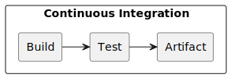
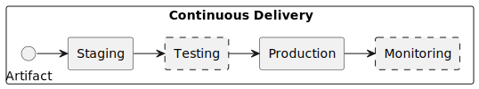

## Understanding the CI/CD Pipeline

Pipelines are fundamental to continuous integration and delivery (CI/CD). Learn how CI/CD pipelines work and how they automate code tests and builds.

### Continuous Integration (CI): Frequent code integration, automated builds, and unit testing.
CI ensures that code changes are frequently integrated into a shared repository, allowing early detection of issues and promoting collaboration among developers.

#### Components:
1. Version Control System (VCS): Developers commit their code changes to a central repository (e.g., Git).
2. Automated Build System: When changes are pushed to the repository, an automated build process triggers. It compiles the code, runs tests, and generates artifacts (e.g., binaries, libraries).
3. Unit Testing: Automated tests validate the correctness of individual code units (functions, classes, etc.).
4. Code Linting and Formatting: Tools check code for adherence to coding standards.
5. Artifact Repository: The build artifacts are stored in a repository (e.g., Nexus, Artifactory).
6. Notification System: Developers receive notifications about build status and test results.

### Continuous Delivery (CD): Automated deployment to staging or production environments.
CD extends CI by automating the deployment process, ensuring that code changes are ready for production.

### Components:
1. Staging Environment: A replica of the production environment where code changes are tested.
2. Deployment Pipeline: A series of automated steps that take code from the repository to production.
3. Automated Testing (Beyond Unit Tests):
    -   Integration Tests: Validate interactions between different components.
    -   Functional Tests: Verify that the application behaves as expected.
    -   Performance Tests: Assess system performance under load.
4. Configuration Management: Tools (e.g., Ansible, Puppet, Chef) manage server configurations.
5. Infrastructure as Code (IaC): Define infrastructure using code (e.g., Terraform, CloudFormation).
6. Deployment Strategies:
   - Blue-Green Deployment: Spin up a new environment (green) alongside the existing one (blue) and switch traffic.
   - Canary Deployment: Gradually roll out changes to a subset of users.
   - Rolling Deployment: Incremental updates.
7. Feature Flags: Enable/disable specific features without deploying new code.
8. Monitoring and Logging: Monitor application health and log events.
9. Automated Deployment to Production:
If all tests pass, the code is automatically deployed to production.
Manual approval gates can be added for critical changes.

### Flow from Code Changes to Deployment:
Developers commit code changes to the VCS.
CI server detects the changes and triggers a build.
Automated tests (unit, integration, functional) run.
If tests pass, artifacts are stored in the repository.
CD pipeline picks up the artifacts.

In the staging environment:
- Infrastructure is provisioned (IaC).
- Application is deployed.
- Additional tests (performance, security) are conducted.

If staging tests pass, the CD pipeline deploys to production (based on the chosen deployment strategy).
Monitoring and logging track the application’s behavior in production.
