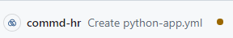
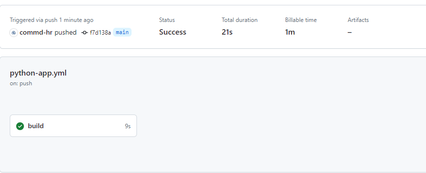
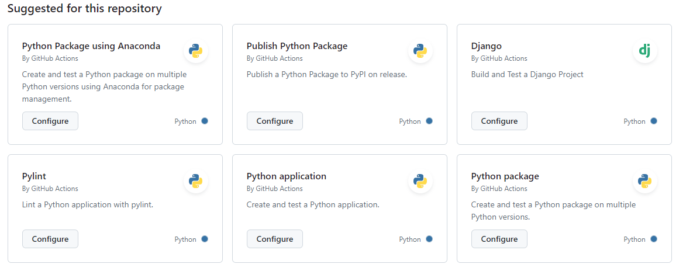

## Creating a Simple CI Pipeline

Let's start by creating our first pipeline that builds our application. It will install the dependencies and lint it against flake8 (like we did manually earlier) to check if we have any errors or faults we should fix.

We first create a folder called `.github/workflows` in our repository in which we will put our yaml file that contains the workflow (pipeline).

Create a file called `python-app.yml` in the `.github/workflows` directory and copy the following YAML contents into this file:

```yaml
# This workflow will install Python dependencies, run tests and lint with a single version of Python
# For more information see: https://docs.github.com/en/actions/automating-builds-and-tests/building-and-testing-python

name: Python application

on:
  push:
    branches: [ "main" ]

jobs:
  build:
    runs-on: ubuntu-latest
    steps:
    - uses: actions/checkout@v4
    - name: Set up Python 3.10
      uses: actions/setup-python@v5
      with:
        python-version: "3.10"
        cache: 'pip'
    - name: Install dependencies
      run: |
        python -m pip install --upgrade pip
        pip install flake8
        if [ -f requirements.txt ]; then pip install -r requirements.txt; fi
    - name: Lint with flake8
      run: |
        # stop the build if there are Python syntax errors or undefined names
        flake8 . --count --select=E9,F63,F7,F82 --show-source --statistics
        # exit-zero treats all errors as warnings. The GitHub editor is 127 chars wide
        flake8 . --count --exit-zero --max-complexity=10 --max-line-length=127 --statistics

```

:question: Stuck or having problems, ask the teacher or a classmate to help you.

<br>

### Understanding the YAML file

Let's dive into this YAML file and check out what is going on.

```yaml
name: Python application
```
The name of the workflow as it will appear in the "Actions" tab of the GitHub repository. If this field is omitted, the name of the workflow file will be used instead.

<br>

```yaml
on:
  push:
    branches: [ "main" ]
```
Specifies the trigger for this workflow. This example uses the `push` event, so a workflow run is triggered every time someone pushes a change to the repository or merges a pull request.  <br>This is triggered by a push to the `main` branch;

<br>

```yaml
jobs:
```
Groups together all the jobs that run in the `Python application` workflow.

<br>

```yaml
  build:
```
Defines a job named `build`. The child keys will define properties of the job.

<br>

```yaml
    runs-on: ubuntu-latest
```
Configures the job to run on the latest version of an Ubuntu Linux runner. This means that the job will execute on a fresh virtual machine hosted by GitHub.

<br>

```yaml
    steps:
```
Groups together all the steps that run in the `build` job. Each item nested under this section is a separate action or shell script.

<br>

```yaml
      - uses: actions/checkout@v4
```
The `uses` keyword specifies that this step will run `v4` of the `actions/checkout` action. This is an action that checks out your repository onto the runner, allowing you to run scripts or other actions against your code (such as build and test tools). You should use the checkout action any time your workflow will use the repository's code.

<br>

```yaml
      - uses: actions/setup-python@v5
        with:
          python-version: "3.10"
          cache: 'pip'
```
This step uses the `actions/setup-python@v5` action to install the specified version of Python. (This example uses version 3.10.) This puts both the `python` and `pip` commands in your `PATH`

<br>

```yaml
      - run: ...
```

<br>

### Viewing the results on GitHub



After we committed our `.github/workflows/python-app.yml` file and pushed it to our remote repository we should see the action running on the repository page on GitHub.


We can find our actions under the actions tab on our repository page. <br>
When we click on the action that is present on the Actions tab, we can get more details about our action.



> Check out more information about workflow that just finished by clicking `build` button in the middle. This will give you more information about this build. <br>
> :question: Stuck or having problems, ask the teacher or a classmate to help you.

In the next chapter we will dive deeper in our just created pipeline and expend it with testing, already curious [06 - Automating our pipeline](06_automation.md)

<br>

### Alternative method



You could also grab the `Python application` from the `Actions` tab on your GitHub Repoisitory. This will add almost the same YAML file (but also include the testing part as step)

<br>

## :tada: Congratulations!

You have learnt :

1.  To create a simple pipeline
2.  Understand the basics of the YAML file
3.  How to view the results on GitHub