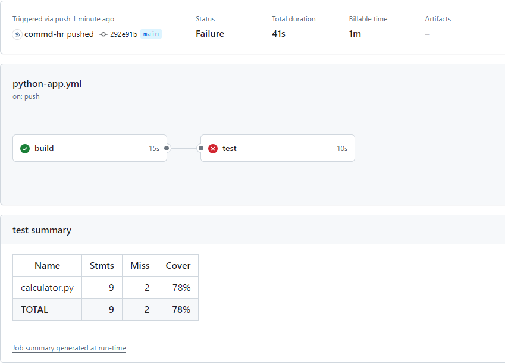

## Automated Testing

Automated testing plays a crucial role in CI/CD pipelines for several reasons:

#### Early Detection of Issues
Automated tests run with every code change, catching bugs and regressions early in the development process. This prevents issues from propagating downstream.

##### Consistent and Reliable Builds
Automated tests ensure that each build is consistent and reliable. Developers can trust that the application behaves as expected across different environments.

##### Faster Feedback Loop
Automated tests provide rapid feedback on code changes. Developers can address issues promptly, reducing the time between writing code and receiving feedback.

##### Reduced Manual Effort
Manual testing is time-consuming and error-prone. Automation frees up testers to focus on exploratory testing and other critical tasks.

##### Increased Confidence
A robust test suite gives confidence that the application works as intended. It’s especially important when deploying to production.

##### Regression Prevention
Automated tests prevent regressions by verifying existing functionality after code changes. This avoids breaking features unintentionally.

---------

<br>

### Integrating testing into the pipeline.

We are going to expand our YAML file we created before by adding an extra job to it.
> You could also just add a step, which is fine for this example, but seperation could help for bigger projects.

```yaml
name: Python application

...

jobs:
  build:
    ...

  test: 
    needs: build
    runs-on: ubuntu-latest
    steps:
    - uses: actions/checkout@v4
    - name: Set up Python 3.10
      uses: actions/setup-python@v5
      with:
        python-version: "3.10"
        cache: 'pip'
    - name: Install dependencies
      run: |
        python -m pip install --upgrade pip
        pip install flake8 pytest
        if [ -f requirements.txt ]; then pip install -r requirements.txt; fi
    - name: Test with pytest
      run: |
        pytest
        pytest --cov --cov-report term --cov-report xml:coverage.xml
```

This should create an extra job on your GitHub Actions page as shown below


> Creating a new job will also create a new runner (which wil bill you twice), for this scenario you could also just include a new step that does the testing. If you are going to implement more tests and want parallel execution in the future, seperation of jobs is adviced,

<br>

### How about that coverage?

To add code coverage we need to add the dependency `coverage` to our `requirements.txt`.<br>
After adding the dependency we need to add an extra command to the run part of our Test:

```yaml
...
    - name: Test with pytest
      run: |
        coverage run -m pytest
    - name: Run code coverage
      run: |
        # Run coverage report
        #coverage xml

        # Report and write to summary.
        coverage report --format=markdown >> $GITHUB_STEP_SUMMARY

        # Report again and fail if under 100%.
        coverage report --fail-under=100
    - name: Store coverage report
      uses: actions/upload-artifact@v4
      with:
        path: coverage.xml
      if: ${{ failure() }}
```

This will run the code coverage based on the pytest we've created.<br>
In our case it will fail since it does not match the `100%` code coverage requirement.<br>
Our workflow output will also have a summary available for the code coverage.




The script will also upload the `coverage.xml` file to the artifact so we can use it in other tools.<br>
This will only happen if the coverage does not match the given amount of percentage.\

```yaml
...
    - name: Store coverage report
      uses: actions/upload-artifact@v4
      with:
        path: coverage.xml
      if: ${{ failure() }}
```

<br>

## :tada: Congratulations!

You have learnt :

1.  Integrate testing into the pipeline
2.  Integrate code coverage into the pipeline