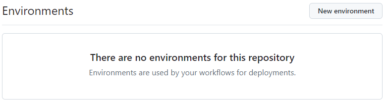
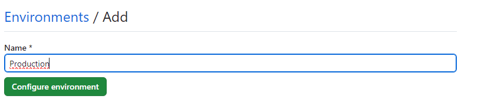

# Environment Management

## Environment types

### Development
Developers use this environment to write, modify, and test code. It’s where they build new features, fix bugs, and experiment.

- Isolation: Developers work independently without affecting other team members.
- Fast Iteration: Frequent code changes and quick feedback.
- Integration with Version Control: Code is committed to a version control system (e.g., Git).
- Local Development: Often runs on developers’ local machines.
- Mock Data: Simulated data for testing.

> The challenge of a development environment is ensuring consistency across different developers’ environments.

<br>

### Staging
A replica of the production environment where changes are tested before deployment.

- Similarity to Production: Configuration, infrastructure, and data closely resemble production.
- Testing Scenarios: Comprehensive testing, including performance, security, and user acceptance.
- Pre-Production Testing: Identifies issues specific to the production setup.
- Limited Access: Restricted to authorized users.

> The challenge of a staging environment is to keep the staging environment in sync with production.

<br>

### Production
The live environment where the application runs for end-users.

- High Availability: Must be reliable and scalable.
- Monitoring and Logging: Continuous monitoring for performance, errors, and security.
- Security Measures: Firewalls, access controls, encryption.
- Rolling Deployments: Gradual deployment of changes to minimize impact.
- Backup and Recovery: Regular backups and disaster recovery plans.

> The challenge of a production environment is balancing it's stability with frequent updates.

<br>

> Can you think of any other environments that could be useful?

<br>

## Pipeline integration

We can add an environment inside our repository so we can set differente jobs based on that environment.<br>
On the main page of the repository, navigate to the settings tab


On the left menu in the settings tab, you have the option of "Environments", this will open the overview of all environments of this repository


From there we can add a new Enviroment, let's say `production`:


> Discover what extra options you can set when you create/edit an enivornment

<br>

From within our `YAML`-file we can now address this environment as shown below 

```yaml
name: Deployment

on:
  push:
    branches:
      - main

jobs:
  deployment:
    runs-on: ubuntu-latest
    environment: production
    steps:
      - name: deploy
        # ...deployment-specific steps
```

When the above workflow runs, the deployment job will be subject to any rules configured for the production environment. For example, if the environment requires reviewers, the job will pause until one of the reviewers approves the job.

> Each job in a workflow can reference a single environment.