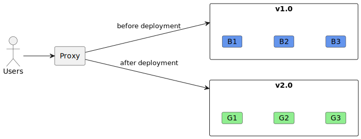
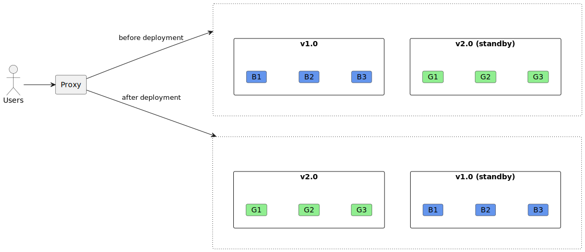
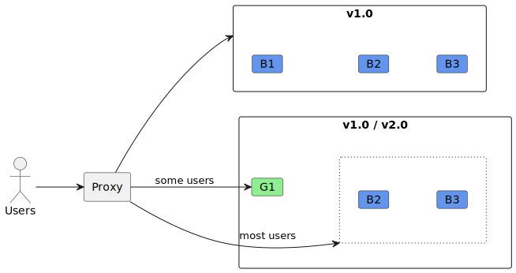
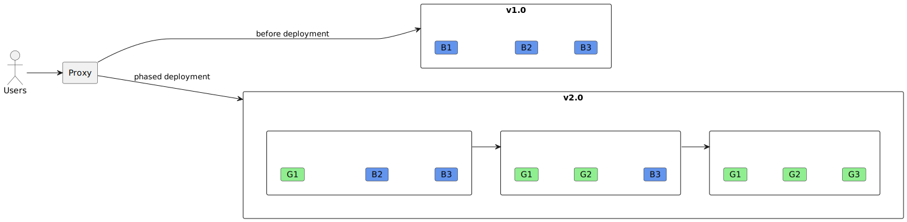
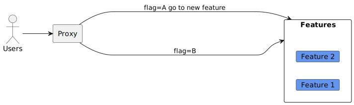

## Deployment Strategies
Continuous Integration, Delivery, and Deployment (CI/CD) are essential practices in modern software development. They aim to reduce errors during integration and deployment while increasing project velocity. Deployment strategies play a crucial role in achieving these goals. Let’s dive into what deployment strategies are and why they matter:

##### What Are Deployment Strategies?
Deployment strategies define how changes to your application code are released to production environments.
They encompass various techniques for managing the deployment process, ensuring smooth transitions from development to production.

##### Why Use Deployment Strategies?
- Risk Mitigation: Deployment strategies help minimize risks associated with deploying new features or bug fixes.
- Zero-Downtime Deployments: Strategies like blue-green deployments and canary releases allow seamless updates without disrupting user experience.
- Rollback Capabilities: Effective strategies enable quick rollbacks in case of issues.
- Performance Optimization: Some strategies optimize resource usage and improve application performance during deployment.

 

### Big Bang Deployment: Regular switching

In software development, a Big Bang deployment involves releasing a new version of software all at once, replacing the existing version. Unlike gradual or incremental approaches, where changes are rolled out step by step, the Big Bang strategy aims for a one-time rollout. However, it has some risks, such as assuming that most defects can be discovered during testing

 

### Blue-Green Deployment: Switching between old and new versions.

Blue-green deployment is an application release model that gradually transfers user traffic from a previous version of an app or microservice to a nearly identical new release. Both versions run in parallel on two identical production environments: the older version operates in the “blue” environment, while testing for the new release occurs in the “green” environment. This approach allows for thorough testing and easy rollback in case of issues. By swapping between the blue and green servers, you can seamlessly transition between versions without downtime, making it a robust deployment strategy.

 

### Canary Deployment: Gradual rollout to a subset of users.

With canary deployments, we release an update to a small group of users (the “canary”) while keeping the rest on the old version. This allows us to test the changes in a real-world environment before a full rollout.

##### Benefits:
- Risk Reduction: Canary deployments are less risky than immediate full rollouts because only a fraction of users are affected initially.
- Insights: They provide valuable insights into how users interact with the changes.
- No Downtime: Upgrades can be done without downtime, and rollbacks are straightforward.

##### Implementation:
- Rolling Deployments: Changes are installed in waves (a few machines at a time).
- Side-by-Side Deployments: Both old and new versions run simultaneously, and traffic is split between them.

 

### Rolling Deployment: Incremental updates.

A rolling deployment is a software update strategy designed to minimize downtime and risk when releasing new versions of an application. Instead of replacing the entire system at once, rolling deployments gradually replace individual components. Here’s how it typically works:

##### Incremental Update:
- Start with two nodes running the current version (let’s say v1.0) of your application.
- Drain the first node to be updated (take it out of the load-balancer pool) while leaving the other node online to serve traffic.
- Deploy the new v1.1 version on the drained node and optionally verify its success.
- Maintain at least one node running v1.0 during this process.

##### Parallelism:
- After the first node updates successfully, proceed to drain the remaining node still running v1.0.
- Now your new v1.1 version serves traffic while the last node is updated.
- Again, verify the deployment if needed.

##### Completion:
- Once v1.1 is deployed successfully to all nodes, your rolling deployment is complete!
- If you want to ramp up deployment, deliver the new version to more than one node simultaneously.

Rolling deployments are favored for web applications behind load balancers, as they support connection draining and ensure continuous availability.

 

### Feature Deployment

Feature deployment is a modern software development practice that decouples feature release from code deployment. It enables quick changes to feature availability on demand. Here are some key concepts:

##### Feature Flags (Toggles):
- Feature flags are binary variables (on/off) associated with specific code blocks.
- They allow you to hide unfinished features in production (dark deployment) or grant early access to new functionality.
- You can turn features on/off without redeploying code, providing an instant kill switch.

##### Use Cases:
- Code Branch Management: Wrap new functionality under development using feature flags. Ship the feature even if it’s unfinished, and it remains dormant in production.
- Test in Production: Grant early access to new features for team members or internal beta testers in the live environment.
- Flighting: Incrementally roll out new functionality to end users by targeting a small percentage initially.
- Selective Activation: Segment users based on features (e.g., browser-specific) without code changes.