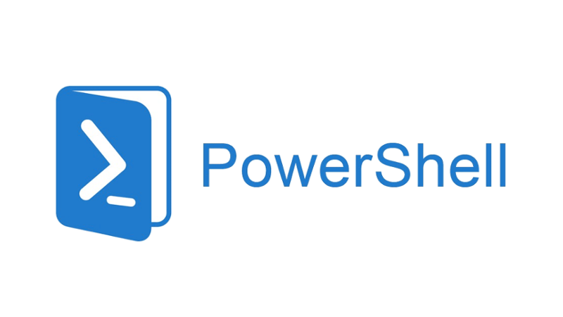
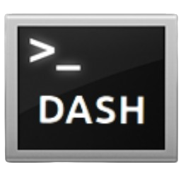

# Introduction to the Shell
The shell is a crucial component of an operating system, acting as an intermediary between the user and the system’s core functions.
During this workshop you will learn:

- What is a shell and what is it used for
- How you can use the shell to navigate, manipulate files and directories and more
- How to write shell scripts
- And some tips for using the shell or shell scripts

 

## Significance
1. **User Interface:** The shell provides a user interface, allowing users to interact with the operating system. This can be through a command-line interface (CLI) or a graphical user interface (GUI).
2. **Command Execution:** It interprets and executes user commands. When you type a command in the terminal, the shell processes it and communicates with the operating system to perform the requested action.
3. **Scripting and Automation:** Shells support scripting, enabling users to write scripts to automate repetitive tasks. This is particularly useful for system administrators and developers.
4. **Customization:** Users can customize their shell environment to suit their preferences, such as setting up aliases, functions, and environment variables.
5. **Process Management:** The shell allows users to manage processes, including starting, stopping, and monitoring them. This is essential for multitasking and system management.

## Actions
1. **Command Interpretation:** The shell interprets the commands entered by the user and translates them into actions that the operating system can execute.
2. **File Manipulation:** It provides commands for file manipulation, such as creating, deleting, copying, and moving files and directories.
3. **Program Execution:** The shell can launch and manage the execution of programs. It can run programs in the foreground or background and handle input/output redirection.
4. **Environment Control:** The shell manages the user environment, including setting environment variables that can affect the behavior of running programs.
5. **Security:** Shells can enforce security policies by restricting access to certain commands or files, ensuring that only authorized users can perform specific actions.

 

## Shells
There are several popular shells used in operating systems, each with its own features and advantages.

### Bash (Bourne Again Shell)
This is probably the most widely used shell in Linux and macOS. \
It’s the default shell on many Linux distributions and macOS.

Top features:
- Supports scripting
- Command history
- Tab completion

 

### Zsh (Z Shell)
A popular shell among power users and developers. \
Often used with the Oh My Zsh framework for additional plugins and themes.

Top features:
- Improved tab completion
- Better scripting capabilities
- Customization

 

### Fish (Friendly Interactive Shell)
This shell is known for its user-friendly features. \
It is gaining traction for its ease of use and modern features.

Top features:
- Syntax highlighting
- Autosuggestions
- Web-based configuration interface

 

### Powershell
This shell is primarily used in Windows environments. \
It is the default shell in Windows but is also available for Linux and macOS.

Top features:
- Object-oriented scripting
- Extensive automation capabilities
- Full integration with .NET

 

### Dash (Debian Almquist Shell)
A lightweight shell used in Debian-based systems. \
Mostly used in scripts and system initialization.

Top features:
- Fast execution
- Minimal resource usage
- POSIX compliance