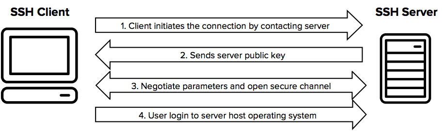

# SSH (Secure Shell) [*optional*]

SSH (Secure Shell) is a protocol used to securely connect to remote servers. It provides a secure channel over an unsecured network by using encryption. This guide will cover the basics of using SSH, setting up SSH keys for passwordless authentication, and configuring SSH access for multiple users.

 

### Basic SSH Usage
To connect to a remote server using SSH, use the following command:

    ssh username@hostname

`username`: The username on the remote server. \
`hostname`: The IP address or domain name of the remote server.

If we would login with the credentials `user` for domain `example.com`, it would look like this:
    
    ssh user@example.com

 

### Running Commands on a Remote Server
You can also run commands on a remote server without logging in interactively

    ssh username@hostname '[command]'

Let's say you want to run the command `ls -la` on the server of `example.com`, we can use:

    ssh user@example.com 'ls -la'

### Using a Specific Port
If your SSH server is running on a non-standard port (e.g., port 2222):

    ssh -p 2222 username@hostname

### Tunneling with SSH
To create an encrypted tunnel to forward a port:

    ssh -L local_port:remote_address:remote_port username@hostname

For example, to forward port 8080:

    ssh -L 8080:localhost:80 john@192.168.1.10

### Transferring Files with SCP
To copy files from your local machine to the remote server:

    scp localfile username@hostname:/path/to/remote/file

For example:

    scp myfile.txt john@192.168.1.10:/home/john/myfile.txt

 

## Using SSH Keys for Authentication
### Generating SSH Keys
To generate a new SSH key pair, use the ssh-keygen command:

    ssh-keygen -t rsa -b 4096 -C "your_email@example.com"

- `-t rsa`: Specifies the type of key to create (RSA).
- `-b 4096`: Specifies the number of bits in the key (4096 bits).
- `-C "your_email@example.com"`: Adds a label to the key.

Follow the prompts to save the key pair to the default location (~/.ssh/id_rsa).

 

### Copying the Public Key to the Server
To use the SSH key for authentication, you need to copy the public key to the remote server. You can use the ssh-copy-id command:

    ssh-copy-id username@hostname

Example:

    ssh-copy-id user@example.com

Alternatively, you can manually copy the public key:

Display the public key:

    cat ~/.ssh/id_rsa.pub

Copy the output and add it to the ~/.ssh/authorized_keys file on the remote server.

 

### Connecting Using SSH Keys
Once the public key is added to the remote server, you can connect without a password:

    ssh username@hostname
 

## Configuring SSH Access for Multiple Users
### Setting Up SSH Keys for Multiple Users
To allow multiple group members to connect to a VPS using SSH keys, each member needs to generate their own SSH key pair and add their public key to the server.

Generate SSH Keys: Each user generates their own SSH key pair using ssh-keygen.
Copy Public Keys to the Server: Each user copies their public key to the server using ssh-copy-id or manually.

 

### Adding Multiple Keys to authorized_keys
On the remote server, the ~/.ssh/authorized_keys file can contain multiple public keys. Each key should be on a new line.

Example:

    ssh-rsa AAAAB3... user1@example.com
    ssh-rsa AAAAB3... user2@example.com
    ssh-rsa AAAAB3... user3@example.com

 

### Managing Access
To manage access, you can add or remove keys from the authorized_keys file. Ensure that the file permissions are set correctly:

    chmod 600 ~/.ssh/authorized_keys
    chmod 700 ~/.ssh

 

### Group Management
If you want to manage access for a group of users, you can create a group on the server and add users to that group. Ensure that the authorized_keys file is accessible to all group members.

Example:

Create a group:

    sudo groupadd sshusers

Add users to the group:

    sudo usermod -aG sshusers user1
    sudo usermod -aG sshusers user2

Set the correct permissions for the .ssh directory and authorized_keys file:

    sudo chown -R user1:sshusers /home/user1/.ssh
    sudo chmod 770 /home/user1/.ssh
    sudo chmod 660 /home/user1/.ssh/authorized_keys

 

### Securing Your SSH Server
To enhance the security of your SSH server, consider the following configurations in your `/etc/ssh/sshd_config` file:

Disable Root Login:

    PermitRootLogin no

Limit User Logins:

    AllowUsers john
    
Use Stronger Encryption Algorithms:

    Ciphers aes256-gcm@openssh.com,chacha20-poly1305@openssh.com

Enable Two-Factor Authentication (2FA):

    AuthenticationMethods publickey,password