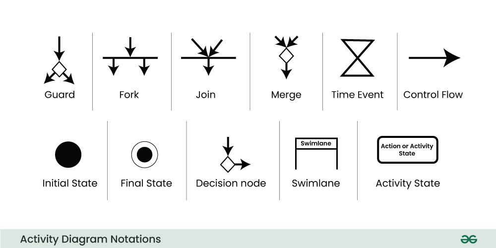
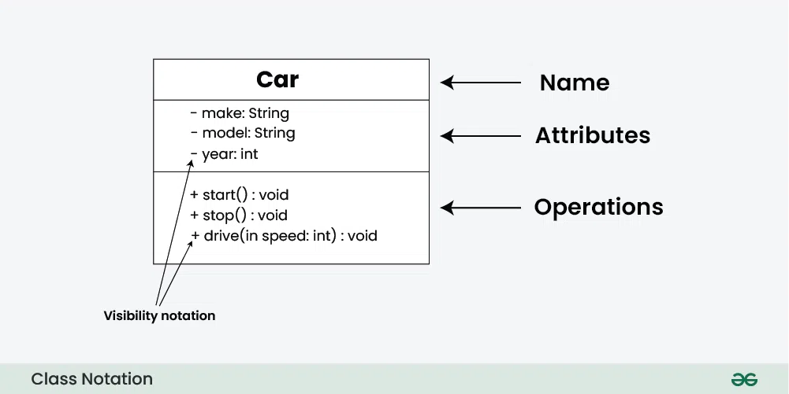
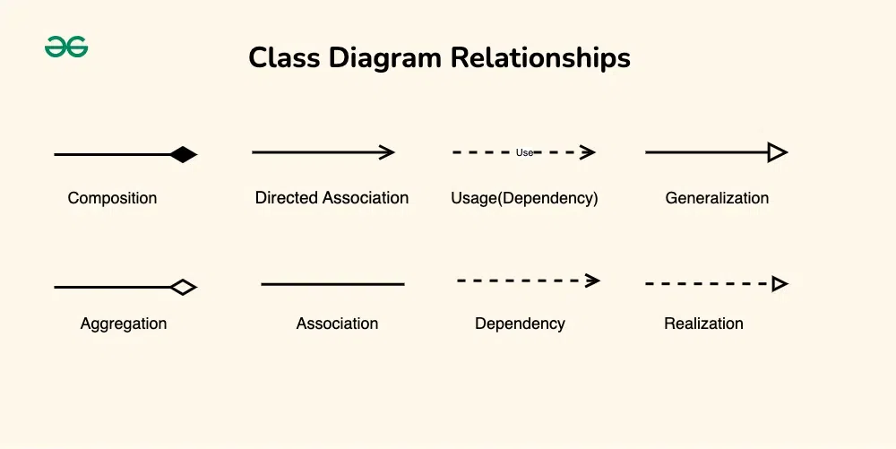

# Using UML diagrams

## What is UML?
Unified Modeling Language (UML) is a standardized visual language for modeling the structure and behavior of software systems. It helps developers, architects and stakeholders understand, document, and communicate the design of a system. UML provides a set of diagram types to capture different aspects of a system, from its static structure to its dynamic behavior.

## Why Use UML?
- **Visualization**: Helps visualize the system's architecture and design.
- **Communication**: Facilitates communication among team members and stakeholders.
- **Documentation**: Provides a clear and comprehensive documentation of the system.
- **Design**: Aids in the design and planning stages of software development.
- **Standardization**: Offers a standardized approach to modeling, which is widely understood and used.

## The GO Sharing Case
To see the usefullness of UML, let's look at **GO Sharing**, an electric bike & scooter sharing platform. It is our goal to reverse engineer their system and describe it with UML diagrams, from multiple perspectives.

### What is GO Sharing?
If you are not familiar with the GO Sharing concept, here's [how it works](https://de.go-sharing.com/en/how-it-works). It also helps to [see it in action](https://www.youtube.com/watch?v=MQx_y_Dd19Y).

#### Activity
Have a look at these sources. We need them as input for our diagramming adventure.

### The Use Case diagram
Let's start with extracting GO Sharing's functional requirements.

Use Case Diagrams serve as a blueprint for understanding the **functional requirements** of a system from a user’s perspective. Use Case diagrams are constructed from the following ingredients:

In the excersise below you are going to explore the ingredients of the Use Case diagram in more depth.

#### Activity
Goal: we want to capture some Use Cases for the GO Sharing system.

1. Extract three use cases from the HOWTO website
2. Read the paragraphs of [this article](https://www.geeksforgeeks.org/use-case-diagram)
3. Sketch a Use Case diagram on paper
4. Share your diagram with the teacher

#### Compare results
There are no wrong results here. Pick out some good ones and some unclear ones and discuss their clarity and expressiveness. The diagrams need to be useful.

#### A possible solution
From the HOWTO page, Youtube and other sources we could extract that there are multiple actors: renters, admins and finance. Each user type can login, but does something different with the system. Possible actions are:

- **Renter**: Create Account
- **Renter**: Sign In User
- **Renter**: Deposit Money

- **Renter**: Locate Scooter
- **Renter**: Rent Scooter
- **Renter**: Pause Renting
- **Renter**: End Renting

- **Admin**: Sign In User
- **Admin**: Display Usage
- **Admin**: List Broken Scooters
- **Admin**: Display Milage Per Scooter

- **Finance**: Sign In User
- **Finance**: Display Gross Turnover

A corresponding Use Case diagram might therefore be

Note that the Use Case diagram makes clear that the functionality of the sign in process is shared among all user types. This could be done in text, but this makes it instantly clear.

### Activity diagram
Now that we know the use cases, let's pick out the renter's use cases and describe the renting process from the renter's perspective. An Activity Diagram is a handy tool for this.

Activity diagrams are used to illustrate the **flow of control** in a system and refer to the steps involved in the execution of a use case. It can depict both **sequential** and **concurrent** flows. It focuses on the conditions of flow and the sequence in which it happens. Their basic ingredients are:

In the excersise below you are going to explore the ingredients of the Activity diagram in more depth.

#### Activity
Goal: work out the flow for the renting process.

1. Read the paragraphs of [this article](https://www.geeksforgeeks.org/unified-modeling-language-uml-activity-diagrams)
2. Draw an Activity diagram on paper
3. Share your diagram with the teacher

#### Compare results
There are no wrong results here. Pick out some good ones and some unclear ones and discuss their clarity and expressiveness. The diagrams need to be useful.

#### A possible solution
To model the rental procedure we assume that the user is signed in, but we don't assume that the user has enough money deposited. There may be other alternative paths, but it is sufficient for now to be aware of the existence of alternative paths.

### Class diagram
Now that we know the use cases of our system, we can extract the entities and their relations + behaviour into a Class Diagram.

Class diagrams provide a high-level overview of a system’s design, helping to communicate and document the structure of the software. They are a fundamental tool in object-oriented design and play a crucial role in the software development lifecycle.

Class diagrams represent the **structure and relationships** of classes in a system and their basic ingredients are:

In the excersise below you are going to explore the ingredients of the Class diagram in more depth.

### Relationships
To describe the relationships between classes we have the following possibilities:

In the excersise below you are going to explore these relationships in more depth.

#### Activity
Goal: setup a Class diagram to model the rental process.

1. Read the paragraphs of [this article](https://www.geeksforgeeks.org/unified-modeling-language-uml-class-diagrams)
2. Sketch a Class diagram on paper
3. Share your diagram with the teacher

#### Compare results
There are no wrong results here. Pick out some good ones and some unclear ones and discuss their clarity and expressiveness. Again: the diagrams need to be useful.

#### A possible solution
We first identify the following classes:

- Account (admin, finance, renter)
- Scooter
- Reservation
- Report (usage, milage, turnover)

From it we can generate the following diagram:

Note the relationship annotations and the cardinality of the relation (one-to-one, one-to-many, ...). This helps us design the Entity Relation Diagram (ERD) for our database. By the way: the ERD is not part of UML.

### Sequence diagram
The frontend app (the client) connects to the GO Sharing server to authenticate the user and to mutate state. This process can become really complex so it would help if we could visualize this process. Sequence Diagrams help us out.

#### Activity
Work out a Sequence diagram for the Money Deposit process via iDEAL. Assume that the renter is already signed in and that GO Sharing uses an intermediate Payment Gateway like Mollie or Stripe that redirects the payment request to iDEAL.

1. Read the paragraphs of [this article](https://www.geeksforgeeks.org/unified-modeling-language-uml-sequence-diagrams)
2. Sketch a Sequence diagram on paper
3. Share your diagram with the teacher

#### Compare results
There are no wrong results here. Pick out some good ones and some unclear ones and discuss their clarity and expressiveness. Again: the diagrams need to be useful.

#### A possible solution
A Payment Gateway offers multiple payment methods and redirects the chosen method to the bank. Here we initiate the payment for iDEAL only.

### State diagram
At this point we have already viewed the system from multiple angles. In our Class diagram we have include multiple classes with state, but we have not yet modelled the transitions between these states. To visualize state transitions UML provides us with the State Diagram.

> Tip: during development you might be tempted to model state with booleans. Don't do that. Why? Because it becomes a maintenance nightmare and it is hard to test. The reasoning goes as follows: 1 boolean represents 2 states, 2 booleans represent 2 * 2 = 4 states, 3 booleans represent 2 * 2 * 2 = 8 states so the number of states grows exponentially. And most of these combinations will be unused. So if you encounter state, use a state machine to model its transitions.

#### Activity
Work out the State diagram for the scooter rental phases.

#### A possible solution
The scooter rental has the following states: `idle`, `active` and `paused`. Below we have depicted the states and the transitions between them. Note that to be consistent, these transition must be represented by methods in the Class diagram.

### Deployment diagram
Okay, we have modelled multiple parts of our system but we have not yet modelled the system as a whole, including its hardware. To model this architecture we can use a Deployment Diagram.

A Deployment Diagram describes the physical deployment of software components on hardware nodes. It illustrates the mapping of **software components onto the physical resources of a system**, such as servers, processors, storage devices, and network infrastructure.

#### Activity
Depict the mobile phone (client device), the server + database and the scooter as hardware nodes. Add to these nodes the artifacts and the communication interfaces.

1. Read the paragraphs of [this article](https://www.geeksforgeeks.org/unified-modeling-language-uml-sequence-diagrams)
2. Sketch a Deployment diagram on paper
3. Share your diagram with the teacher

#### A possible solution
Here we depict the hardware nodes, the artifacts deployed on them and the communication interfaces in a diagram:

## Conclusion
We have shown how to use UML to describe a system from multiple angles. Hopefully you see that this adds clarity to our documentation for multiple stakeholders. Also, by comparing our results, you see that there is no right solution. What counts is that our models represent the system and that they are simple and usable.