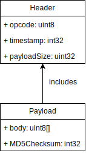

# Generating UML diagrams
In the lesson before we have drawn the diagrams by hand. This works fine until we need to edit the diagrams. In practice we therefore chose to create digital diagrams.

There are two ways of generating digital UML diagrams:

- Creating them manually with a drawing tool
- Generating them via a markup language

Below we discuss the pros and cons for both methods.

## Creating Manually
The easiest way is to use an online tool like Draw.io. It's free to use, supports UML and you can export your diagrams and save them in your Git repo.

There is however one big disadvantage: you have to draw the diagrams by hand, which means that adjusting the diagrams takes time. You have to:

- Load your current diagram into Draw.io
- Edit the diagram
- Save the updated diagram
- Export the updated diagram

### Activity

1. Go to `draw.io` (it will redirect to app.diagrams.net but that's fine)
2. Recreate the message diagram of the Voyager (see introduction)

It should look like this:



3. Export the generated XML
4. Push this XML to Github

NASA just told us that the timestamp must now be of type `int64`. To know why, read this [Wikipedia article](https://en.wikipedia.org/wiki/Year_2038_problem).

5. Update the message diagram with the required change

It should look like this:


6. Export the generated XML
7. Push this XML to Github
8. Compare the Git commits
9. Is the difference clear?

### Pros
Although it took a bit of click work, without any knowledge of the Draw.io tool you were able to generate some pretty styled diagrams. That's an absolute plus of graphical edit tools.

### Cons
But as you have noticed, it takes quite some steps to generate and update the diagram. Because of that you will be less likely to update the diagrams when things change. So eventually your diagrams will become outdated and thus lose their value. Or they become harmfull because they introduce confusion or chaos. Like code, UML may get "dirty" too. It would be better to integrate it into our workflow.

## Using a Markup Language
Since this course is about Proces & Tools we prefer a scripting way. Again, we look for a free to use tool that supports UML. One of those tools is PlantUML. It's open source, which is a big plus.

### PlantUML
PlantUML is a tool that uses a markup language to describe a range of UML diagrams. This markup language is easy to edit and from it we can generate diagrams. It can be combined with Github Actions so that changes automatically generate new diagrams.

### Installing PlantUML
For this workshop we use the PlantUML VSCode plugin.

#### Activity
Follow the steps on the [plugin site](https://marketplace.visualstudio.com/items?itemName=jebbs.plantuml) to install and configure PlantUML.

### The PlantUML docs
Learning PlantUML takes a bit of time but the [project website](https://plantuml.com) gives a good introduction. It contains lots of examples and describes to generation of each UML diagram in detail.

#### Activity
Your first PlantUML diagram.

1. Create a new file in VSCode and name it voyager_message.puml
2. Browse the PlantUML site to see which diagram fits
3. Recreate the message diagram of the Voyager
4. Push this PUML to Github

It should look like:


But note that the constructed PlantUML diagram is based on an Object diagram. This is of course incorrect usage of UML. Object diagrams describe the state of an object at a specific moment in time. We used the Object purely for a visual comparison with the Draw.io diagram... and to have this discussion ;) What would have been the correct diagram? Probably a Class diagram to model the message `struct`. PlantUML support the `struct` keyword.

5. Adjust your diagram and replace `object` with `struct`
6. Push this PUML to Github
7. Compare the Git commits
8. Is the difference clear?

Let us briefly discuss PlantUML's pros and cons.

### Pros
In short: integration into the process means higher quality and speed.

#### Using ChatGPT
Another pro is that we can use ChatGPT. ChatGPT has seen a lot of PlantUML examples and is really good at generating PUML. Try the following:

*Can you generate a sequence diagram for the Voyager Probe in PlantUML?*

The current ChatGPT version generates:

```
@startuml
    actor "NASA Mission Control" as NASA
    actor "Deep Space Network (DSN)" as DSN
    participant "Voyager Probe" as Voyager

    NASA -> DSN: Send command
    DSN -> Voyager: Relay command
    Voyager -> DSN: Acknowledge command

    DSN -> Voyager: Request telemetry data
    Voyager -> DSN: Send telemetry data
    DSN -> NASA: Forward telemetry data

    NASA -> DSN: Request scientific data
    DSN -> Voyager: Relay request
    Voyager -> DSN: Send scientific data
    DSN -> NASA: Forward scientific data

    NASA -> DSN: Send new instructions
    DSN -> Voyager: Relay new instructions
    Voyager -> DSN: Acknowledge receipt of instructions
    DSN -> NASA: Confirm instructions delivered
@enduml
```

which translates into the following diagram:


This is pretty accurate! And a good starting point for your PlantUML journey.

**P.S.**

ChatGPT may be able to read Draw.io XML but its quality will probably lower.

### Cons
PlantUML has a learning curve which is a con. But we must see this learning as an investment. An investment in quality and speed. Use this period to practice and familiarize yourself with PlantUML. You will thank yourself for this while writing up your internship and graduation thesis.